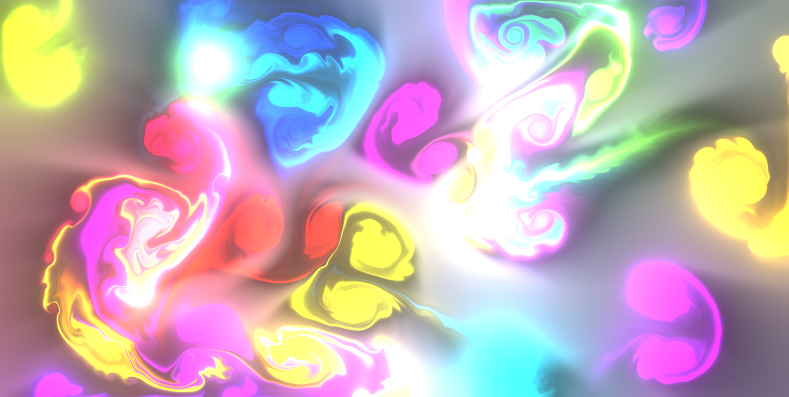

# react-webgl-fluid

React functional component wrapper on canvas with webgl fluid simulation script (saving for personal use later).

Change config values in [the script in ./public/fluid-script](./public/fluid-script.js) - mine aren't the default. Script is more up to date copy paste of https://github.com/PavelDoGreat/WebGL-Fluid-Simulation

Removed the GUI; left P and space shortcuts untouched

